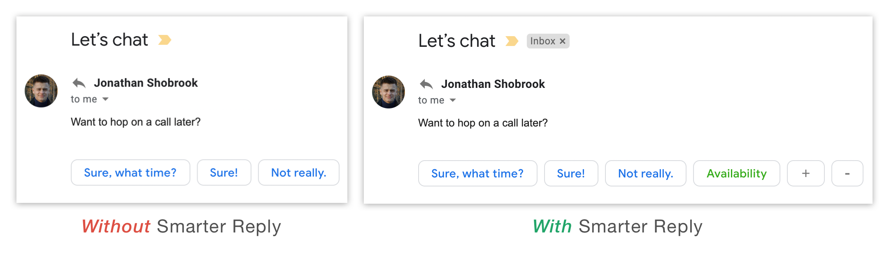
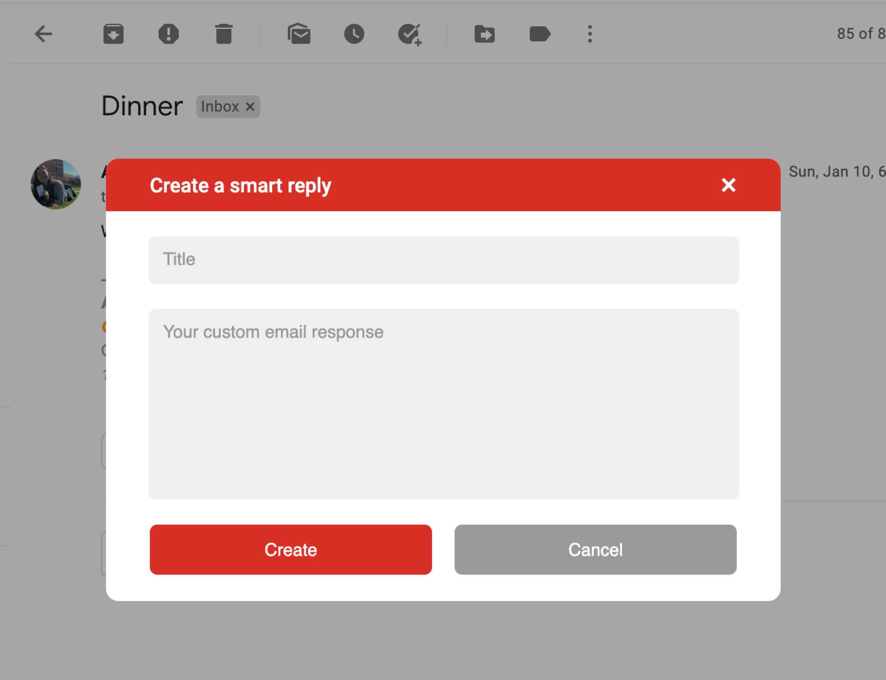
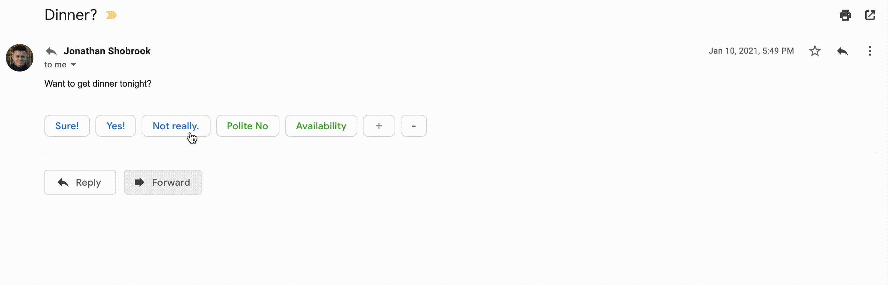
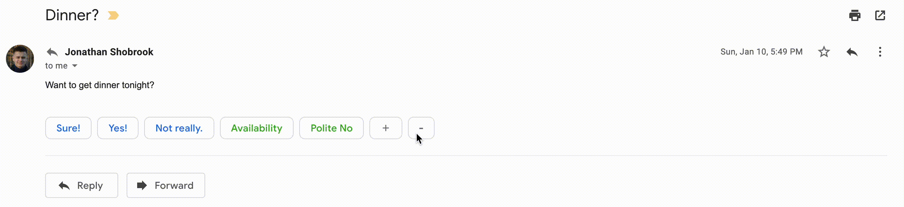

<h1 align="center">
  
   
</h1>

Gmail has a feature called "Smart Reply," where users can select from a list of recommended responses when replying to an email. But Gmail doesn't allow you to create your own smart replies. _Smarter_ Reply for Gmail is a Chrome extension which does let you create custom replies, and will learn to recommend the right reply for a given email.

## Installation

You can download the extension on the [Chrome web store](). Or you can install the development version of the extension by cloning the repo, navigating to [chrome://extensions/](chrome://extensions/), selecting "Load Unpacked" in the top-left corner, and uploading the repo.

## Usage

Before using Smarter Reply, go to your Gmail settings and enable Smart Compose. It is usually enabled by default.

  

### 1. Creating a Smarter Reply

To create a Smarter Reply, open an email that already has smart replies. Click the "+" button and you should see a prompt for creating a new smart reply. Enter the title and body of your message and then click "Create."

  

### 2. Using a Smarter Reply

To use your Smarter Reply, simply click it as you would a regular smart reply. An email draft should be created and autofilled with your smart reply.

### 3. Deleting a Smarter Reply

To delete a Smarter Reply, click the "-" button and then select the Smarter Reply(ies) that you would like to delete. Then click the "-" button again.

## How it Works

Smarter Reply is written in pure Javascript and has no dependencies. The event loop is pretty straightforward:

1. Background script (`background.js`) detects when a user opens an email and sends a signal to the content script (`content.js`)
2. Content script scrapes the email content and sends it back to the background script
3. Background script searches the Chrome cache for the best matching Smarter Replies (\*) and sends them to the content script
4. Content script injects JS into the Gmail frontend to render the Smarter Replies
5. When a Smarter Reply is created, clicked, or deleted on the frontend, the content script sends a signal to the background to update the Chrome cache

\* Smarter Replies are recommended by a unigram model, which calculates the similarity of the received email to the set of emails associated with each Smart Reply. Here's how it works:

1. An opened email is scraped and preprocessed (stopword and punctuation removal, uniform capitalization, and stemming)
2. For each Smarter Reply, a bag-of-words (BoW) model is fitted from the previous emails associated with that Smarter Reply
3. The BoW model produces a vector for the input email, _xi_, and each associated email, _y0, y1, ..., yn_
4. _y0, y1, ..., yn_ are summed to create _y_, a vector representing word frequencies across all associated emails
5. Cosine similarity between _xi_ and _y_ is calculated, and the Smarter Replies with the highest similarity measures are returned to the frontend
